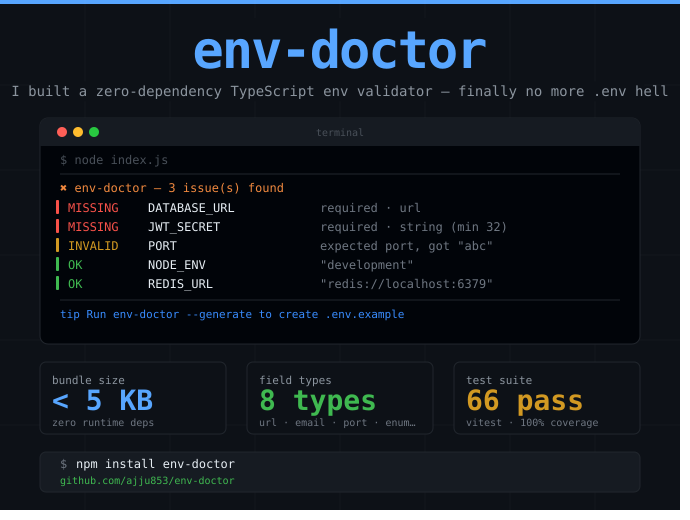

# env-doctor



**Zero-dependency TypeScript-first environment variable validator.**  
Tells you exactly what's wrong in plain English — not a wall of errors.

```ts
import { validate } from '@ajjupateldev/env-doctor';

const env = validate({
  PORT: { type: 'port', required: true },
  DATABASE_URL: { type: 'url', required: true },
  NODE_ENV: { type: 'enum', values: ['development', 'production', 'test'] },
  JWT_SECRET: { type: 'string', minLength: 32, required: true },
  API_BASE_URL: { type: 'url' },
});
```

## The problem

You deploy. Something crashes. You dig through logs hunting for `undefined is not a function` — turns out `DATABASE_URL` was never set. Or `PORT` is `"abc"`. Or `NODE_ENV` is `"staging"` instead of `"production"`.

Existing tools either require heavy boilerplate (Zod), are unmaintained (envalid), or have zero validation (dotenv). env-doctor fixes this in <5KB with zero deps.

## Install

```sh
npm install @ajjupateldev/env-doctor
```

## Quick start

```ts
import { validate } from '@ajjupateldev/env-doctor';

const env = validate({
  PORT: { type: 'port', required: true },
  DATABASE_URL: { type: 'url', required: true },
  NODE_ENV: {
    type: 'enum',
    values: ['development', 'production', 'test'],
    default: 'development',
  },
  JWT_SECRET: { type: 'string', minLength: 32, required: true },
  API_BASE_URL: { type: 'url' },
});

// env.PORT       → number
// env.DATABASE_URL → string (validated URL)
// env.NODE_ENV   → string (default: 'development')
// env.JWT_SECRET → string (min 32 chars)
// env.API_BASE_URL → string | undefined
```

### Terminal output

```
✖ env-doctor — 3 issue(s) found

  MISSING DATABASE_URL required · url
  MISSING JWT_SECRET   required · string (min 32 chars)
  INVALID PORT         expected a numeric port, got "abc" · port
  OK  NODE_ENV         "development"

  tip Run env-doctor --generate to create .env.example
```

## API

### `validate(schema)`

Reads `process.env`, coerces and validates each field against your schema. Returns a typed object.

Throws `EnvValidationError` if any required fields are missing or invalid. The error contains a `results` array with detailed per-field status.

### Schema reference

| Type        | Options                                    | Coerces to | Description                              |
|-------------|--------------------------------------------|------------|------------------------------------------|
| `string`    | `minLength`, `maxLength`                   | `string`   | Plain string with optional length check  |
| `number`    | —                                          | `number`   | Parses numeric string                    |
| `boolean`   | —                                          | `boolean`  | Accepts `true/false/1/0/yes/no`          |
| `url`       | —                                          | `string`   | Validates with `URL` constructor          |
| `email`     | —                                          | `string`   | Regex email check                        |
| `enum`      | `values: string[]`                         | `string`   | Must be one of allowed values            |
| `json`      | —                                          | `unknown`  | Parses JSON string                       |
| `port`      | —                                          | `number`   | Integer 1–65535                          |

All field types accept these options:

| Option        | Type      | Default | Description                            |
|---------------|-----------|---------|----------------------------------------|
| `required`    | `boolean` | `false` | Throws if var is missing/empty         |
| `default`     | `string`  | —       | Fallback value when var is not set     |
| `description` | `string`  | —       | Used in `.env.example` generation      |
| `example`     | `string`  | —       | Used in `.env.example` generation      |

### `.env.example` generation

```ts
import { generateExample } from '@ajjupateldev/env-doctor';

generateExample({
  PORT: { type: 'port', required: true, description: 'Server port', example: '3000' },
  DATABASE_URL: { type: 'url', required: true, description: 'PostgreSQL connection string' },
});
```

Writes `.env.example`:

```sh
# Environment Variables
# Generated by env-doctor

# Server port
# Type: port — required
PORT=3000

# PostgreSQL connection string
# Type: url — required
DATABASE_URL=https://example.com
```

### CLI

```sh
npx env-doctor --help
npx env-doctor --version
npx env-doctor --check       # Validate against env.schema.ts
npx env-doctor --generate    # Create .env.example from schema
```

env-doctor looks for `env.schema.ts`, `env.config.ts`, `env.schema.js`, or `env.config.js` in the current directory.

## TypeScript inference

```ts
import { validate } from '@ajjupateldev/env-doctor';
import type { InferEnv, Schema } from '@ajjupateldev/env-doctor';

const schema = {
  PORT: { type: 'port' },
  NODE_ENV: { type: 'enum', values: ['dev', 'prod'] },
  DEBUG: { type: 'boolean' },
  CONFIG: { type: 'json' },
} satisfies Schema;

type Env = InferEnv<typeof schema>;
//   ^? { PORT: number; NODE_ENV: string; DEBUG: boolean; CONFIG: unknown }

const env = validate(schema);
// env.PORT     → number
// env.NODE_ENV → string
// env.DEBUG    → boolean
// env.CONFIG   → unknown
```

## Comparison

| Feature                  | env-doctor | envalid | dotenv | Zod + manual |
|--------------------------|------------|---------|--------|--------------|
| Zero runtime deps        | ✓          | ✗       | ✓      | ✗            |
| TypeScript inference     | ✓          | ✓       | ✗      | ✓            |
| Colored terminal output  | ✓          | ✗       | ✗      | ✗            |
| `.env.example` generator | ✓          | ✗       | ✗      | ✗            |
| Maintained (2025+)       | ✓          | ✗       | ✓      | ✓            |
| Bundle size              | <5 KB      | ~25 KB  | ~5 KB  | ~50 KB+      |
| Framework agnostic       | ✓          | ✓       | ✓      | ✓            |

envalid is unmaintained. dotenv has no validation. Zod requires manual parsing boilerplate. env-doctor is purpose-built for env validation with zero ceremony.

## Built with


- **TypeScript** — full type inference from schema
- **Node.js** — works with any framework (Express, Fastify, Next.js, etc.)
- **tsup** — dual ESM + CJS bundle
- **Vitest** — 66+ tests
- **Zero runtime dependencies** — <5 KB install size

## License

MIT
